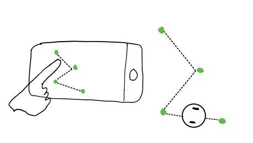
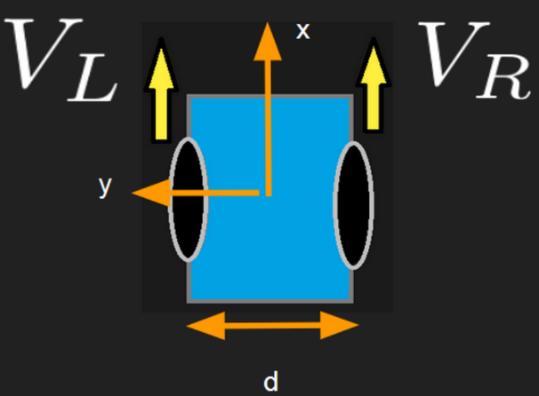

# Robo-AR
Anmol Parande, Jay Monga, Eashaan Katiyar, Ankit Agrawal

## Overview
Our goal is to control Romi using AR. The basic idea is that the user will be able to “draw” a path by setting waypoints in an AR environment using a smartphone app, and the robot will drive from waypoint to waypoint.

## Goals
Our goals for this project are as follows.
1. Implement BLE communication between the robot and the phone.
2. Implement closed-loop feedback control to make sure the robot stays on the drawn path and rejects disturbances.
3. While the phone application is under development, we will test our robot control and the networking commands in a simulation environment.
4. We will combine robot sensor data with localization data provided by the AR to understand where the robot is localized in the environment and how it is oriented.

For more concrete implementation details, see the “Approach” section.

Beyond our main goals, we have additional features we could potentially implement if we have enough time and find ourselves ahead of schedule:
1. Allow the user to draw more interesting trajectories beyond straight lines between waypoints, such as following curves using cubic spline interpolation.
2. Implementing a control system where if the robot deviates from the path, the phone can detect and correct the robot. This could be accomplished by placing visual feature tags on Romi such as ArUco markers.
3. Develop advanced state estimation of the Romi through methods such as Kalman filtering or robot localization in ROS by combining encoders, acceleration, and gyroscope sensor data.
4. More interesting control (formalize state and input cost for MPC or optimal control over piecewise trajectory)
5. Allowing for obstacle avoidance so when the robot encounters an obstacle on the drawn path, it can navigate around the obstacle and then return to the original path

## Approach
Our mobile application will be an iOS app written in Swift, and the AR component will be handled by ARKit. ARKit will provide the real-world coordinates of the waypoints as well as the distances between them. The app will connect with the Romi via BLE and transmit a series of (x, y) coordinates representing the waypoints in the 2D plane the robot travels in. When the “start” instruction is received from the app, the robot will start following the waypoints.

To keep the robot on the trajectory, we will use a closed-loop PID controller on the wheel velocities. We drive our robot in open loop and use Least Squares to fit our model of the system that we can then control. While the robot is driving, we will also use the encoders and gyroscope with basic filtering to maintain an understanding of where the robot is localized in space.

To test the controls to our robot, we will develop the controls and response to BLE commands in a Gazebo simulation requirement. We will design an API for the BLE connection so we can test the robot’s response to simulated bluetooth messages as well.

For assumptions we will make through the project, see the assumptions section.

## Assumptions:
1. The robots dynamics will be constant throughout the entire duration
2. Differential-drive modeled robot (Romi)

3. Affine motor model with respect to input

4. Robot receives full knowledge of trajectory before moving
5. Static environment (obstacles won’t appear/disappear after initial plan is made)

## Resources

We plan to use a lot of the existing hardware available to us for this project. In terms of the Robot, we intend to utilize the Romi’s gyro, accelerometer, and motor encoders in order to provide strong robot localization. Furthermore, we will use its BLE capabilities in order to interface with a mobile device. We will be using Apple Iphones as that mobile device, which come with AR (augmented reality) features. We will implement our AR app using Apple’s ARKit API.

### Potentially Relevant Tutorials
- [Drawing in the Air with Bare Fingers](https://www.toptal.com/swift/ios-arkit-tutorial-drawing-in-air-with-fingers)
- [Measure Distance Between Two Points on a Horizontal Plane in Augmented Reality](https://mobile-ar.reality.news/how-to/arkit-101-measure-distance-between-two-points-horizontal-plane-augmented-reality-0185297/)
- [Understanding World Tracking in ARKit](https://developer.apple.com/documentation/arkit/world_tracking/understanding_world_tracking)
- [Visualizing and interacting with a reconstructed scene in ARKit](https://developer.apple.com/documentation/arkit/world_tracking/visualizing_and_interacting_with_a_reconstructed_scene)
- BLE Technology (Lab 9)  
- [Bluetooth Development on iOS](https://www.novelbits.io/intro-ble-mobile-development-ios/)
- [Recognizing and Labeling Arbitrary Objects](https://developer.apple.com/documentation/arkit/recognizing_and_labeling_arbitrary_objects)
- [Detecting Images in an AR Experience](https://developer.apple.com/documentation/arkit/detecting_images_in_an_ar_experience)
- [Tracking and Altering Images](https://developer.apple.com/documentation/arkit/tracking_and_altering_images)    

## Schedule
Due Date     | Task          | Assignee  |  Goal
------------ | ------------- | --------- | ---- 
Nov 6        | Determine the requirements and capabilities of the AR-Kit | Anmol + Ankit | Get a barebones app running on iOS and understand what information we can get from points in AR.
Nov 6        | Do networking lab (Lab 9) + understand how to use the BLE technology for this project | Jay + Eashaan | Complete and understand complexity surrounding BLE technology and how it relates to our project
Nov 6        | Architecture Drawing | All of Us | Complete architecture drawing for our robot system
Nov 15       | Have closed loop controls, auto-calibration, and basic filtering implemented for every important sensor in simulations. | Jay + Eashaan | Be able to run the robot in simulation and mock sensor data. 
Nov 15       | Have an app which sets waypoints and stores their real-world coordinates | Anmol | Be able to draw and send waypoints on an app -- shouldn’t be too much else to do with this app. 
Nov 15       | Set up interface for bluetooth in hardware and mock up in simulation     | Ankit | Be able to send bluetooth commands to the robot in simulation. 
Nov 22       | Transition all controls to hardware | All of Us | Romi should be able to run consistently with correct feedback.
Nov 29       | Integration of BLE with controls and AR. | All of Us | Start testing our system in the real world.
Dec 6        | Debugging + Testing + Stretch Goals + Spillover | All of Us | Finalize implementation.
Dec 15       | Project Poster/Expo Creation. Create a video demo. | All of us | Present our project to the class and GSI’s.
Dec 18       | Final Report | All of us | Complete the Final Report summarizing the project result

## Risks
A major risk we face is our heavy reliance on ARKit for a variety of functions, ranging from path creation to object detection. Thus, our robot’s success for this project will likely be dependent on the technological limits of ARKit. 

Another thing to consider is the noise and drift experienced by the sensors, which could lead to difficulty in reliably following the desired trajectory. Further issues with the networking component of the Romi may arise, as we do not currently understand. Thus, bluetooth communication may not be able to adequately send information about trajectory

Lastly, as we near the end of our project, we may experience mismatch in behaviour between the simulated Kobuki and physical Romi device. Furthermore, the requisite integration of various modules for our system, which includes networking, Romi control, augmented reality -- each of which has its own complexities and idiosyncrasies -- may fail to work nicely together. These issues could prove fatal to the execution of our project at a very late stage in the semester.

